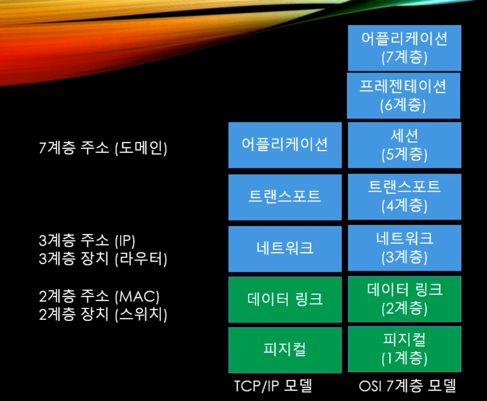

# 네트워크 기초

서버의 안정성이 매우 중요하기 때문에 서버 프로그래머는 네트워크 기초 이론을 습득해야 한다. 

네트워크 패킷을 보내는 방식은 택배를 보내는 방식과 매우 유사하다. 

## 통신 모델 

### TCP/IP 모델

- 어플리케이션 : 유저 인터페이스(HTTP, FTP)
- 트랜스포트 : 전송 확인 / 오류 해결 (TCP, UDP)
- 네트워크 : 네트워크 간 경로 설정, IPv4, IPv6 (라우터)
- 데이터 링크 : 네트워크 내 경로 설정 (이더넷, PPP, 스위치)
- 피지컬 : 물리적 신호 처리 (케이블 / 링크)

### 주소

- 7계층 주소(도메인)
- 3계층 주소 (IP)
- 3계층 장치 (라우터)
- 2계층 주소(MAC) : 네트워크 카드에 박혀있는  주소, 기기가 바뀌지 않는 한 계속 유지
- 2계층 장치(스위치)

실제 패킷이 이러한 단계를 거쳐 완성이 되면서 전달된다. 

