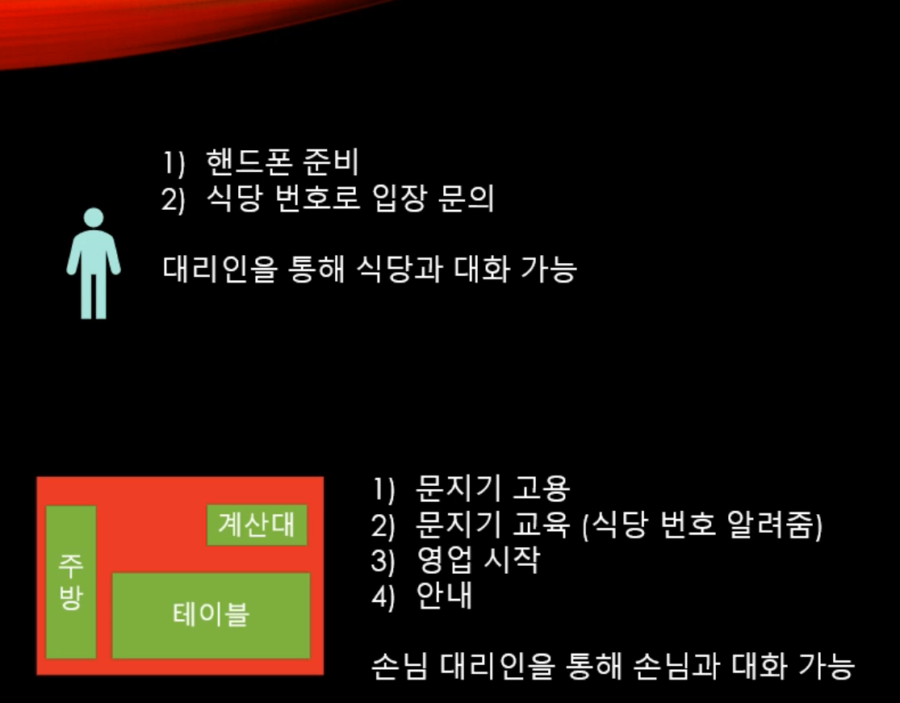
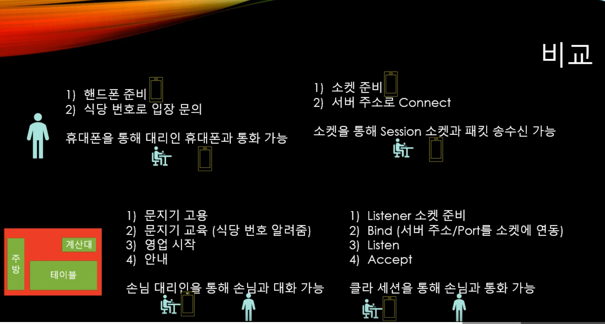

# 소켓 프로그래밍 기초

식당에 들어가려면 입구가 있어야 하는 것처럼 컴퓨터끼리의 연결에서도 입구가 필요한데 그것이 소켓이다. 입구에는 문지기가 있고, 문지가는 고객응대를 하고 전화도 받고, 들어올 수 있는 사람이 맞는지 체크하는 일을 한다. 



  



  

## 기초 코드 (Blocking 계열의 서버)

실제 MMORPG에서는 Blocking을 사용하지 않는다. 상대의 패킷이 올 때까지 계속 가만히 기다릴 수는 없기 때문에.

#### Server

```c#
using System;
using System.Net;
using System.Net.Sockets;
using System.Text;
using System.Threading;
using System.Threading.Tasks;

namespace ServerCore
{

    class Program
    {
       
        
        static void Main(string[] args)
        {
            // DNS(Domain Name System)
            string host = Dns.GetHostName();
            IPHostEntry ipHost = Dns.GetHostEntry(host);
            // 구글과 같은 큰 서비스의 경우에는 하나의 Domain name에 대응하는 여러 개의 IP Address가 있을 수 있다.
            IPAddress ipAddr = ipHost.AddressList[0]; 
            // 엔드포인트 객체를 만들어서 초기화한다. (IP와 Port Number를 mapping)
            IPEndPoint endPoint = new IPEndPoint(ipAddr, 7777);

            // 문지기 
            Socket listenSocket = new Socket(endPoint.AddressFamily, SocketType.Stream, ProtocolType.Tcp);

            try
            {
                // 문지기 교육
                listenSocket.Bind(endPoint);

                // 영업 시작
                // backlog : 최대 대기수
                listenSocket.Listen(10);

                while (true)
                {
                    Console.WriteLine("Listening...");

                    // 손님을 입장시킨다
                    // 손님과 대화하고 싶으면 이 소켓을 통해 대화하면 된다
                    Socket clientSocket = listenSocket.Accept();

                    // 받는다 
                    byte[] recvBuff = new byte[1024];
                    // 몇 바이트 받았는지 리턴
                    int recvBytes = clientSocket.Receive(recvBuff);
                    string recvData = Encoding.UTF8.GetString(recvBuff, 0, recvBytes);
                    Console.WriteLine($"[From Client] {recvData}");

                    // 보낸다 
                    byte[] sendBuff = Encoding.UTF8.GetBytes("Welcome to MMORPG Server!");
                    clientSocket.Send(sendBuff);

                    // 쫓아낸다 
                    clientSocket.Shutdown(SocketShutdown.Both);
                    clientSocket.Close();

                }
            }

            catch (Exception e)
            {
                Console.WriteLine(e.ToString());
            }
        }
    }
}

```

#### Client

```c#
using System;
using System.Net;
using System.Net.Sockets;
using System.Text;
using System.Threading;
using System.Threading.Tasks;

namespace DummyClient
{
    class Program
    {
        static void Main(string[] args)
        {
            // DNS(Domain Name System)
            string host = Dns.GetHostName();
            IPHostEntry ipHost = Dns.GetHostEntry(host);
            // 구글과 같은 큰 서비스의 경우에는 하나의 Domain name에 대응하는 여러 개의 IP Address가 있을 수 있다.
            IPAddress ipAddr = ipHost.AddressList[0];
            // 엔드포인트 객체를 만들어서 초기화한다. (IP와 Port Number를 mapping)
            IPEndPoint endPoint = new IPEndPoint(ipAddr, 7777);

            // 휴대폰 설정
            Socket socket = new Socket(endPoint.AddressFamily, SocketType.Stream, ProtocolType.Tcp);

            try 
            {
                // 문지기한테 입장 문의
                socket.Connect(endPoint);
                Console.WriteLine($"Connected To {socket.RemoteEndPoint.ToString()}");

                // 보낸다
                byte[] sendBuff = Encoding.UTF8.GetBytes("Hello World!");
                int sendBytes = socket.Send(sendBuff);

                // 받는다
                byte[] recvBuff = new byte[1024];
                int recvBytes = socket.Receive(recvBuff);
                string recvData = Encoding.UTF8.GetString(recvBuff, 0, recvBytes);
                Console.WriteLine($"[From server] {recvData}");

                // 나간다
                socket.Shutdown(SocketShutdown.Both);
                socket.Close();
            }
            catch (Exception e)
            {
                Console.WriteLine(e.ToString());
            }
        }
    }
}

```

