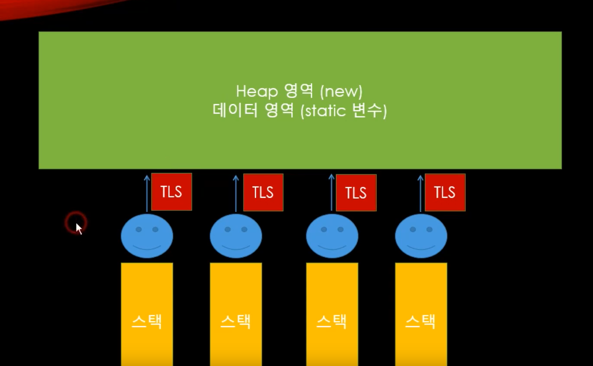

# Thread Local Storage

## TLS의 정의

전역변수인데 스레드마다 고유하게 접근할 수 있는 스토리지이다. 즉 스레드 별 저장공간을 말한다.



## 필요한 이유

일감이 모두 각각 독립적이지도 않고, 서로 같은 데이터를 건드릴 수도 있기 때문에 멀티스레드의 핵심은 일감 분배이다. 

스레드별로 고유한 전역변수(또는 정적변수)를 사용하기 어렵다. 스레드를 그냥 만들면 스레드에게 주어진 혼자만의 공간은 지역적인 stack이 되고 임시적인 메모리이기 때문에 불안정하다. 일반적인 전역변수는 다 공유되는 data영역에 저장되는데, 이 변수는 모든 스레드가 공유하므로 접근시 race condition이 발생할 수 있다. 특히 특정 로직, 특정 데이터에 순간적으로 일감이 몰리게 되면 락, 언락이 계속 발생하고 기아상태에 빠질 수가 있기 때문에 비효율적이게 된다. heap에 만들어도 private heap이 아닌 이상 모두에게 공유되는 공간이다. 이 때문에 스레드별로 저장공간을 만들어줄 필요가 있다.


### 참고 : 전역변수와 정적 변수의 차이

전역변수와 정적 변수의 lifetime은 동일하다. 프로그램이 죽을 때까지 한 번 할당된 변수 메모리와 값은 유지된다. 반면에 scope가 다르다. 전역 변수는 해당 프로그램(실행파일 기준)의 어느 함수, 어느 파일에서도 접근이 가능한 반면에 정적변수는 변수가 선언된 파일이나 함수 내에서만 가능하다.


## TLS 변수 만들어보기

```c#
using System;
using System.Threading;
using System.Threading.Tasks;

namespace ServerCore
{

    class Program
    {
        // TLS 변수 만들기
        // TLS 변수를 건드리는 것은 굳이 Lock을 할 필요가 없어진다
        static ThreadLocal<string> ThreadName = new ThreadLocal<string>(()=> { return $"My Name is {Thread.CurrentThread.ManagedThreadId}";  });

        static void WhoAmI()
        {
            // 스레드 하나가 하나의 Task만 맡는 것이 아니기 때문에 이미 만들어진 스레드가 또 일감을 잡은 것인지 처음 잡은 것이지 확인하기 위한 코드
            bool repeat = ThreadName.IsValueCreated;
            if (repeat)
                Console.WriteLine(ThreadName.Value + "(repeat)");
            else
                Console.WriteLine(ThreadName.Value);
        }
        
        static void Main(string[] args)
        {
            ThreadPool.SetMinThreads(1, 1);
            ThreadPool.SetMaxThreads(3, 3);
            Parallel.Invoke(WhoAmI, WhoAmI, WhoAmI, WhoAmI, WhoAmI, WhoAmI, WhoAmI);
        }
    }
}

```

