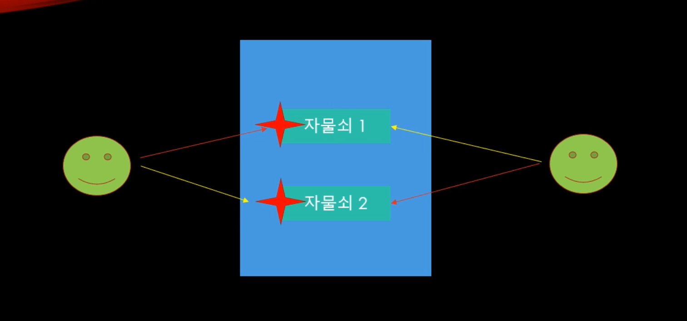

# Lock 기초 

## interlocked의 단점

성능이 빠르고 우수하지만, 정수만 사용할 수 있다는 치명적인 단점이 있다. 다양한 연산에 대하여 lock하는 경우가 필요하다.


## Lock 사용

Lock을 사용하여 상호 배제를 구현할 수 있다. 상호배제는 멀티스레드 프로그래밍에서 공유 불가능한 자원의 동시 사용을 피하기 위해 사용되는 알고리즘을 말한다.

```c#
using System;
using System.Threading;
using System.Threading.Tasks;

namespace ServerCore
{
    class Program
    {
        static volatile int number = 0;
        static object _obj = new object();
        

        static void Thread_1()
        {
            // 연산의 원자성이 보장되어야 한다.

            for (int i = 0; i < 100000; i++)
            {
                Monitor.Enter(_obj); // 문을 잠그는 행위, _obj를 자물쇠라고 생각하자
                number++;
                Monitor.Exit(_obj);  // 잠금을 풀어준다.
            }
        }
         
        static void Thread_2()
        {
            for (int i = 0; i < 100000; i++)
            {
                Monitor.Enter(_obj);
                number--;
                Monitor.Exit(_obj);
            }
        }
        

        static void Main(string[] args)
        {
            Task t1 = new Task(Thread_1);
            Task t2 = new Task(Thread_2);
            t1.Start();
            t2.Start();

            Task.WaitAll(t1, t2);

            Console.WriteLine(number);
        }
    }
}

```


만약에 Lock을 해주고 Unlock을 하지 않으면 다른 스레드가 Unlock을 기다리고 있고 아무 작업이 일어나지 않는 상태에 도달한다. 이를 Deadlock 상황이라고 한다. 가령 아래와 같이 Thread_1에서 Unlock을 하지 않고 return 해버린다거나..

```c#
static void Thread_1()
        {
            // 연산의 원자성이 보장되어야 한다.

            for (int i = 0; i < 100000; i++)
            {
                Monitor.Enter(_obj); // 문을 잠그는 행위, _obj를 자물쇠라고 생각하자
                number++;
                return ;
                Monitor.Exit(_obj);  // 잠금을 풀어준다.
            }
        }
```


### 일반적인 Lock 기능 사용

잠궜으면 반드시 풀어야하기 때문에 실수를 방지하기 위하여 try, finally를 사용할 수 있다.

```c#
static void Thread_1()
        {
            // 연산의 원자성이 보장되어야 한다.

            for (int i = 0; i < 100000; i++)
            {
                try
                {
                     Monitor.Enter(_obj); // 문을 잠그는 행위, _obj를 자물쇠라고 생각하자
                	number++;
                	return ;
                }
               finally
               {
                	Monitor.Exit(_obj);  // 잠금을 풀어준다.   
               }
            }
        }
```

하지만 일반적으로 C#에서는 lock을 사용한다. 위의 코드와 동일하지만 훨씬 코드가 간결해지고 실수를 줄여준다. 알아서 unlock을 해준다.

```c#
static void Thread_1()
        {
            // 연산의 원자성이 보장되어야 한다.

            for (int i = 0; i < 100000; i++)
            {
               lock (_ojb)
               {
                   number++;
               }
            }
        }
```


# 데드락



자물쇠 잠그는 순서를 서로가 반대로 한다면 데드락이 발생할 수 있음.

이를 해결하기 위해서는 자물쇠를 잠그는 순서에 관한 규약을 만들어야 한다.

## 데드락이 걸리는 상황

스레드가 서로가 서로가 언락되기를 기다리게 되면 데드락 상황에 빠진다. 사이클이 생겨버리기 때문에.

사실 실무적으로 다같이 코드를 짜거나, 다른 사람의 코드를 유지보수 하는 과정을 겪다보면 데드락을 예방하기가 쉽지 않다. 데드락 상황은 콜 스택을 추적하다보면 디버깅하기가 나름 쉬운 편이라서 그때 가서 고치는 경우가 상당히 많다.

그리고 개발단계에서는 일어나지 않다가 라이브 서비스 상황에서 발생하는 경우도 많다.

```c#
using System;
using System.Threading;
using System.Threading.Tasks;

namespace ServerCore
{
    class SessionManager
    {
        static object _lock = new object();
        public static void TestSession()
        {
            lock (_lock)
            {

            }
        }
        public static void Test()
        {
            lock (_lock)
            {
                UserManager.TestUser();
            }
        }

    }

    class UserManager
    {
        static object _lock = new object();

        public static void Test()
        {
            lock (_lock)
            {
                SessionManager.TestSession();
            }

        }

        public static void TestUser()
        {
            lock (_lock)
            {

            }
        }
    }

    class Program
    {
        static volatile int number = 0;
        static object _obj = new object();
        

        static void Thread_1()
        {
            // 연산의 원자성이 보장되어야 한다.
            // 상호배제 보장 Mutual Exclusive

            for (int i = 0; i < 10000; i++)
            {
                SessionManager.Test();
            }
        }
         
        static void Thread_2()
        {
            for (int i = 0; i < 10000; i++)
            {
                UserManager.Test();
            }
        }

        static void Main(string[] args)
        {
            Task t1 = new Task(Thread_1);
            Task t2 = new Task(Thread_2);
            t1.Start();
            t2.Start();

            Task.WaitAll(t1, t2);

            Console.WriteLine(number);
        }
    }
}

```


# Lock 구현 연습

멀티스레드 프로그래밍에서 Lock 구현이 60~70퍼센트를 차지할 정도로 중요한 부분이다.

## 잠겨있는 스레드를 기다리는 방법

만약 화장실 똥칸이 꽉 차서 다음 차례를 기다려야할 때, 기다리는 방법이 몇 가지가 있을 것이다.

1. 앞에 서서 안에 있는 사람이 나올 때까지 기다린다. 아무것도 하지 않고 기다린다. (**SpinLock**)

   - 스레드가 CPU를 점유하고 계속 기다리는 (체크하는) 상황이기 때문에 CPU 사용률이 확 튀게 된다.

2. 풀방인 것을 보고 내 할 일을 다시 보다가 이따가 다시 와서 아직도 풀방인지 확인한다. 자리가 날 때까지 수시로 와서 확인한다. 

   - 스레드가 자기 소유권을 포기하는 상황임.
   - 수시로 와서 확인한다는 것은 컨텍스트 스위칭을 사용하는 것인데 이것은 생각보다 부하가 많이 일어나는 것이다. 사람의 입장에서 봤을 때도 일을 하다말고 수시로 왔다갔다 하면서 확인을 해야하는데 당연히 일의 집중도가 떨어질 것이다.

3. 다른 사람한테 망을 보게 시키고 자리가 나면 알려달라고 한다.

    - 커널에게 부탁하는 이벤트 방식을 사용

      

