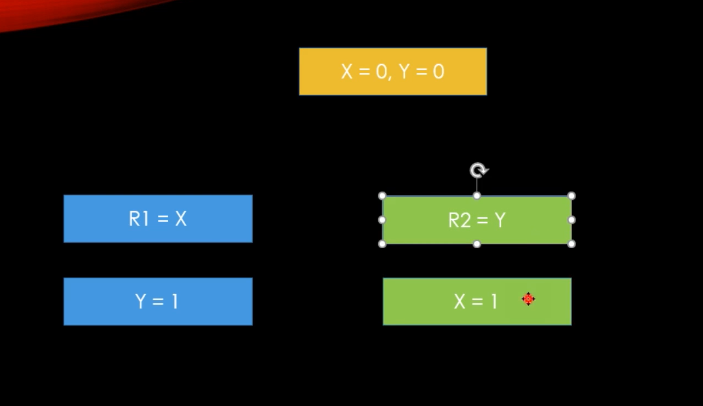

# 메모리 배리어

하드웨어 최적화에 관하여

```c#
using System;
using System.Threading;
using System.Threading.Tasks;

namespace ServerCore
{
    class Program
    {
        static int x = 0;
        static int y = 0;
        static int r1 = 0;
        static int r2 = 0;

        static void Thread_1()
        {
            y = 1; // Store y
            r1 = x; // Load x 
        }

        static void Thread_2()
        {
            x = 1; // Store x
            r1 = y; // Load y
        }

        static void Main(string[] args)
        {
            int count = 0;
            while (true)
            {
                count++;
                x = y = r1 = r2 = 0;

                Task t1 = new Task(Thread_1);
                Task t2 = new Task(Thread_2);
                t1.Start();
                t2.Start();

                Task.WaitAll(t1, t2);  // t1, t2 끝날 떄까지 메인스레드는 대기

                if (r1 == 0 && r2 == 0)
                    break;
            }

            Console.WriteLine($"{count}번만에 빠져나옴!");
        }
    }
}

```

위 코드는 무한루프를 돌아야할 것 같은데 이상하게도 생각보다 빨리 루프를 빠져나옴. 이유가 뭘까?

컴파일러 차원의 최적화 뿐만 아니라 하드웨어 자체의 최적화도 이루어진다. 



thread_1의 y=1, r1=x 두 부분은 서로 로직상 연관성이 없기 때문에 더 빠르게 최적화하는 과정에서 순서가 바뀌게 될 수 있음. 따라서 r1과 r2가 동시에 0이 되는 순간이 존재하게 된다.


## 메모리 배리어의 개념

### 정의

중앙 처리 장치나 컴파일러에게 특정 연산의 순서를 강제하도록 하는 기능.

중앙 처리 장치에서는 연산 결과에 영향이 가지 않는 선에서 최적화하다보면 연산의 순서를 뒤바꿀 수 있으며, 컴파일러도 비슷한 최적화를 수행한다. 하지만, 이러한 기능은 여러 스레드가 동시에 돌아가는 경우, 코드의실행 순서가 바뀌어 실행되는 동안 다른 스레드에서 그 부분에 대한 메모리를 접근하여 잘못된 결과를 내놓을 수 있다. 따라서 특정 부분에 대하여 실행 순서를 강제하는 메모리 배리어를 놓아야 한다. 

### 목적

- 코드 재배치 억제
- 가시성

### 메모리 배리어 설정

```c#
using System;
using System.Threading;
using System.Threading.Tasks;

namespace ServerCore
{
    class Program
    {
        static int x = 0;
        static int y = 0;
        static int r1 = 0;
        static int r2 = 0;

        static void Thread_1()
        {
            y = 1; // Store y
            Thread.MemoryBarrier();
            r1 = x; // Load x 
        }

        static void Thread_2()
        {
            x = 1; // Store x
            Thread.MemoryBarrier();

            r1 = y; // Load y
        }

        static void Main(string[] args)
        {
            int count = 0;
            while (true)
            {
                count++;
                x = y = r1 = r2 = 0;

                Task t1 = new Task(Thread_1);
                Task t2 = new Task(Thread_2);
                t1.Start();
                t2.Start();

                Task.WaitAll(t1, t2);  // t1, t2 끝날 떄까지 메인스레드는 대기

                if (r1 == 0 && r2 == 0)
                    break;
            }

            Console.WriteLine($"{count}번만에 빠져나옴!");
        }
    }
}

```

### 메모리 배리어의 종류

- 1) Full Memory Barrier(ASM MFENCE, c# Thread.MemoryBarrier) : Store/Load 둘다 막는다.

- 2) Store Memory Barrier(ASM SFENCE) : Store만 막는다

- 3) Lad Memory Barrier(ASM LFENCE) : Load만 막는다


### 가시성

쉽게 말해서 한 스레드에서 변경한 특정 메모리 값이 다른 스레드에서 제대로 읽어지는지에 관한 것.

한 코어 또는 스레드에서 사용하는 메모리 값이 여러 코어 또는 스레드에서 공유하는 메모리 값이라면, 스레드에서의 작업 내용을 메인 메모리에 반영하는 작업을 수행해야 메모리 가시성을 수행할 수 있다. 

캐시의 값을 메인 메모리에 반영하는 과정은 느리기 때문에 적절히 필요한 시점에 메모리 배리어를 이용해서 반영해야한다.

메모리 배리어를 만나면 레지스터나 캐시의 값 변경을 메인메모리에 반영하면 된다. 


