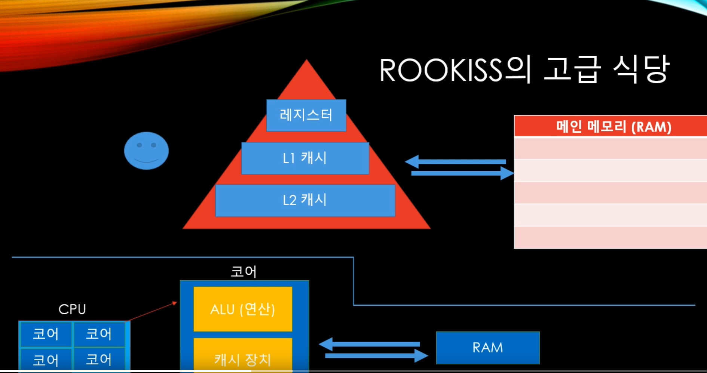

# 캐시 이론




메모리는 cpu와 거리가 있기 때문에 매번마다 메모리를 갱신하는 것은 부하가 좀 있는 일이고 속도면에서도 손해가 있다. 그래서 cpu 내에 더 작은 기억 장치인 캐시 메모리를 사용하게 된다.


## 캐시 철학

- 1) Temporal locality
  - 시간적으로 보면, 방금 주문한 테이블에서 추가 주문이 나올 확률이 높다. 방금 주문한걸 메모해 놓으면 편리하지 않을까?
  - 최근 사용된 변수가 또 사용될 확률이 높음
- 2) Spacial locality
  - 공간적으로 보면, 방금 주문한 사람 근처에 있는 사람이 추가 주문을 할 확률이 높다. 방금 주문한 사람과 합석하고 있는 사람들의 주문 목록도 메모해 놓으면 편하지 않을까?
  - 최근 사용한 변수 근처 주소에 있는 변수가 사용될 확률이 높음


## 캐시는 무조건 좋은가?

멀티스레드 환경에서 한 스레드가 어떤 데이터를 조작하고 그걸 캐시에만 저장해놨을 때, 다른 스레드에서 같은 데이터를 조작한다면 최신의 데이터를 가지고 조작하는 것이 아니게 된다. 이러면 문제가 발생한다. 


## 공간적 지역성의 예시

```c#
using System;
using System.Threading;
using System.Threading.Tasks;

namespace ServerCore
{
    class Program
    {
        

        static void Main(string[] args)
        {

            int[,] arr = new int[10000, 10000];
            {
                {
                    long now = DateTime.Now.Ticks;
                    for (int y = 0; y < 10000; y++)
                        for (int x = 0; x<10000; x++)
                            arr[y, x] = 1;
                    long end = DateTime.Now.Ticks;
                    Console.WriteLine($"(y,x ) 순서 걸린 시간 {end - now}");


                }

                {
                    long now = DateTime.Now.Ticks;

                    for (int y = 0; y < 10000; y++)
                        for (int x = 0; x < 10000; x++)
                            arr[x, y] = 1;
                    long end = DateTime.Now.Ticks;
                    Console.WriteLine($"(y,x ) 순서 걸린 시간 {end - now}");
                }
            }
        }
    }
}

```

위의 코드가 캐시 히트 상황이어서 상대적으로 더 빠르다.

```
(y,x ) 순서 걸린 시간 8912094
(y,x ) 순서 걸린 시간 14928514
```


