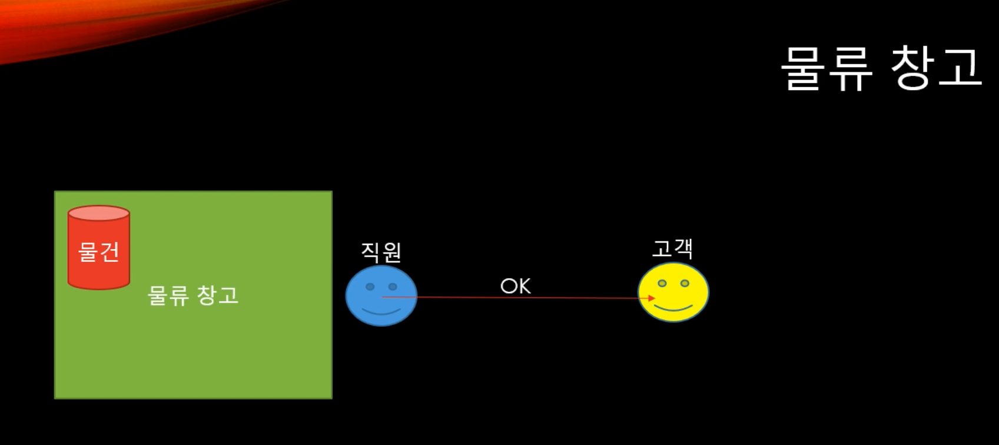

# 데이터베이스 원리

마치 물류 창고와 같은 데이터베이스

근데 물류 창고를 이용하는 고객도 많고, 직원도 많고, 빠르고 안전하게 물건을 돌려줘야 한다면?

1. 많이 (병렬처리)
2. 빠르게 (응답 속도)
3. 안전하게 (커밋한 데이터를 지킨다)

많이, 빠르게, 안전하게는 서로 상충하는 경우가 많다. 예를 들어,  DISK I/O는 빠르지 않다.

## 데이터의 탐색

### Full Scan과 Sequential 접근

Full Scan 자체는 디스크의 어떤 영역의 있는 데이터를 다 훑어오는 것이다. 하지만 만약 필요한 데이터가 동 떨어져있는데 무식하게 다 훑어보고 긁어오는 것은 비효율적일 수 있다.

### Index와 Random access

Index를 설정해두면 어떤 부분을 읽으면 어떤 데이터를 얻을 수 있는지 미리 알 수 있다. 하지만 띄엄띄엄 필요한 데이터를 찾아 체크해야하기 때문에 디스크가 돌아야하고, 때문에 index 설정이 무조건 속도가 빠르지는 않다.

전체 데이터가 15%를 넘어가면 full scan, 낮다면 index가 빠르다는 통계적 자료가 있다.

## 데이터를 어디에 저장할 것인가?

RAM은 전원이 꺼지면 사라지는 휘발성 데이터이다. 따라서 데이터 안정성을 위해 디스크에 저장해야 한다. 그렇다고 필요할 때마다 진짜로 모든 데이터를 디스크에 저장하며 너~무 느리다.

