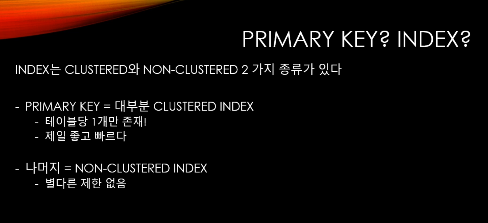
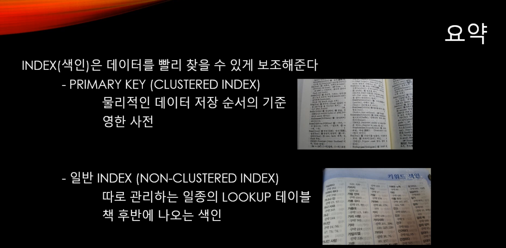

# 인덱스

데이터베이스 단골 질문 분야이자 인덱스가 없으면 데이터베이스를 쓸 이유가 없을 정도로 중요하다.


이진 검색 트리를 활용한다. 


## 기본키와 인덱스

둘다 빠른 검색을 가능하게 한다.

### 


### Clustered Index

실제 데이터가 키에 따라 정렬된 상태로 저장. 영한사전과 같은 모양이다. 색인도 필요가 없다고 볼 수 있음. 별도의 공간에 색인을 만들 필요가 없다. 

기본키가 반드시 clustered index는 아니다. 기본적으로 이렇게 설정이 되어있을 뿐이긴 한데 그렇게 하지 않을 이유는 없다고 보면 된다. 





```mssql
-- 인덱스 CREATE INDEX / DROP INDEX 
CREATE UNIQUE INDEX i1 ON accounts(accountName);
DROP INDEX accounts.i1;
CREATE CLUSTERED INDEX i1 ON accounts(accountName);  -- 클러스터형 인덱스는 테이블에 하나밖에 만들 수 없다. 
```

