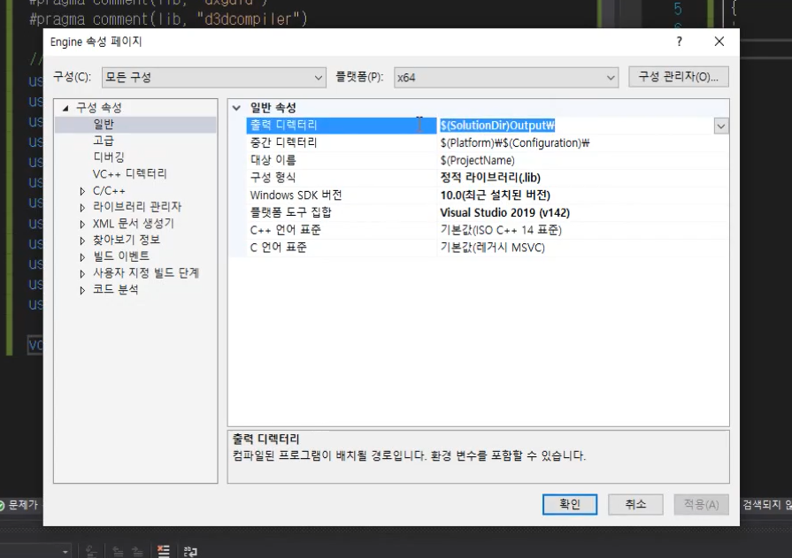

# visual studio 개발환경 세팅

## 미리 컴파일된 헤더

- 자주 활용하는 기능들을 프로젝트, 파일 마다 매번 include 하기는 상당히 번거로운 일이다.
- 그래서 공용으로 아주 많이 사용하는 것들을 한 곳에 모아서 관리할 수 있는데 `이것을 미리 컴파일된 헤더라고 한다` 
- 관리의 이점도 있지만 이름에서 알 수 있듯이 한 번 컴파일해두기 때문에 이후 빌드 속도에도 이점이 있다. 따라서 자주 컴파일되지 않도록 필요한 것들만 잘 넣고 관리할 필요가 있다.
- 보통 해당 헤더 파일의 이름으로는 `stdafx.h` 또는 `pch.h`를 많이 사용한다.
- 설정 방법
  - 
  - 
- 이렇게 설정해두고 새로 클래스를 생성하면 자동으로 `pch.h`가 include 되어 있음
  - 

## 라이브러리 생성

- engine 부분을 라이브러리 프로젝트로 분리시키는 이유는 게임이 하나가 아니고 여러 개를 만들어야할 때, 공통으로 사용되는 부분을 새로운 게임에 이식, 재사용하기가 쉬워지기 때문이다. 필요할 때마다 갖다 쓰기만 하면 되는데, 그게 아니면 새 게임 만들 때마다 하나하나 복사해야함.
- 라이브러리 프로젝트를 생성하면 main 함수는 없다 .

## 빌드 결과물 출력 디렉터리 변경

- 솔루션 위치에 output 디렉터리 생성
  - 절대경로보다는 상대경로를 사용하는 것을 권장
  - 

## 라이브러리 디렉터리 설정

- 포함 디렉터리에는 헤더파일이 위치하고 있는 디렉터리 추가
  - 
- 라이브러리 디렉터리에는 라이브러리 파일이 빌드된 위치를 추가(라이브러리 파일이 존재하는 곳)
  - 
- 라이브러리 파일 링커/종속성 설정
  - 
  - 속성에서 위와 같이 변경하는 것이 아니라 직접 코드를 추가해서 간편하게 수행할 수 있음
  - 

## 외부 라이브러리 추가하는 방법

- [Visual Studio에 외부 라이브러리 추가하기](http://bbagwang.com/programming/cpp/visual-studio%EC%97%90-%EC%99%B8%EB%B6%80-%EB%9D%BC%EC%9D%B4%EB%B8%8C%EB%9F%AC%EB%A6%AC-%EC%B6%94%EA%B0%80%ED%95%98%EA%B8%B0/)